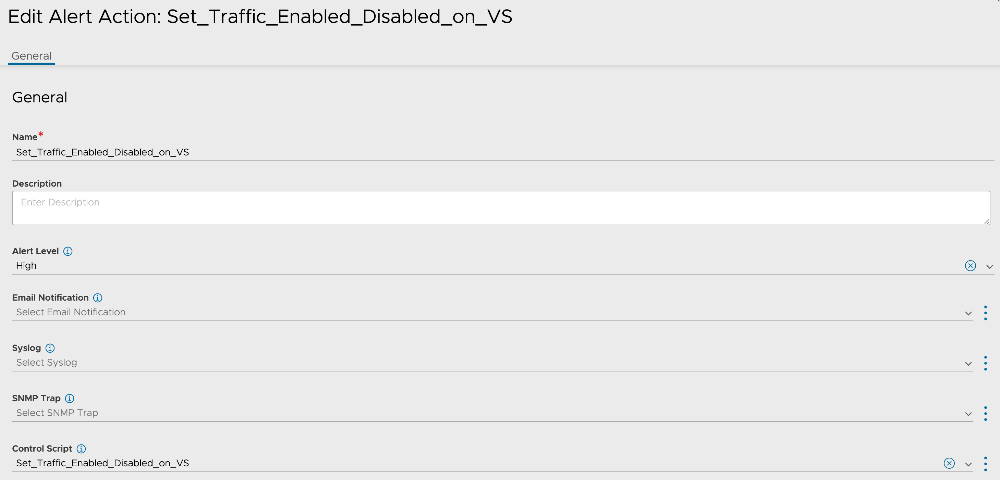
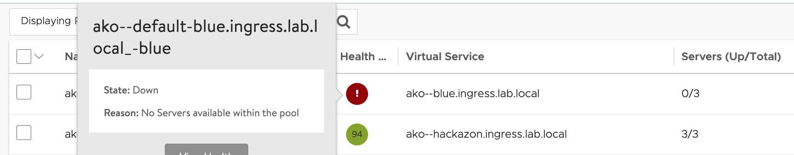

# Summary
This ControlScript can be used to enable or disable traffic to an Avi Virtual Service with an accompanying alert trigger.

# Configuration Steps
Create a ControlScript under Templates > Scripts > ControlScripts. Import main.py from this repository or copy and paste the text, then click Save.

Create an Alert Action under Operations > Alert Actions to fire the ControlScript.

Create Alert Config under Operations > Alert Config which will associate a particular event to the Alert Action. This ControlScript looks for "VIP_UP" and "VIP_DOWN" Alerts.

# Testing / Validation

Using a test virtual service that is in a working state, verify that the Traffic Enabled knob is turned on.

Disable the pool associated with the virtual service

Wait for the alert to fire. During testing this could take up to 2 minutes. The alert can be viewed under Operations > All Alerts. Note the logs of the alert will detail which virtual service the ControlScript updated and to what value the traffic_enabled attribute was set.

Verify that the traffic enabled attribute has been updated

Enable the pool associated with the virtual service

Wait for the alert to fire again.

Verify that the traffic enabled attribute has updated accordingly.

